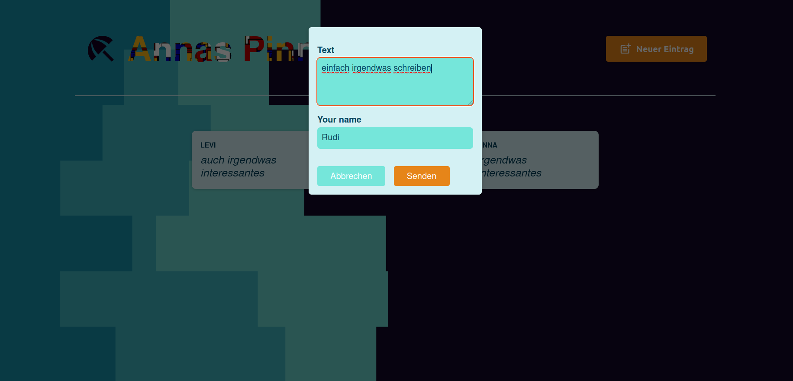

# Demo Single-Page-App für Pinnwandeinträge - jetzt mit React Router

 In dieser WebApp können Einträge über eine Modulkomponente erstellt und auf der Pinnwand angezeigt werden (mit minimalem Backendsupport)




## Technologien

- **Frontend:**
  - React + Vite [¹]
  - React Router
  - useState()
  - useEffect()

- **Backend:** [²]
  - Node.js
  - Express

## To do 

- Validierung der Einträge
- Backend mit Datenbank Support
- loader()

## Projektstruktur

```
e-my-ud-vite0/
├── backend/
│   ├── data/
|   |   └── post.js   
|   |     
|   ├── app.js   
|   |   
|   ├── package.json
|   |   
|   └── posts.json   
|      
├── src/
│   ├── assets/
│   ├── components/
│   │   ├── MainHeader.jsx
│   │   ├── MainHeader.module.css
│   │   ├── Modal.jsx
│   │   ├── Post.jsx
│   │   ├── Post.module.css
│   │   ├── PostsList.jsx
│   |   └── PostsList.module.css
|   |
│   ├── routes/
│   │   ├── NewPost.jsx
│   │   ├── NewPost.module.css
│   │   ├── Post.jsx
│   |   └── RootLayout.jsx
│   |
|   |
|   ├── index.css
|   └── main.jsx
|
├── eslint.config.js
├── index.html
├── package.json
├── README.md
└── vite.config.js
```


## Installation

Installiere die Abhängigkeiten für das Backend und Frontend:

- Frontend:

     ```bash
     npm install
     ```
- Backend:

     ```bash
     cd backend
     npm install
     ```

## Backend

Das Backend verwendet Node.js mit Express. Die Daten werden in posts.json gespeichert.

### Starten des Servers

1. Starte den Entwicklungsserver:
   
   ```bash
   cd backend
   npm start
   ```

Der Server sollte jetzt auf `http://localhost:8080` laufen.

## Frontend

### Starten der Anwendung

1. Starte die React Entwicklungsumgebung:
   
   ```bash
   npm run dev
   ```
## Verwendung

Nach dem Start der Backend- und Frontend-Server kannst du die Pinwand App im Browser unter `http://localhost:5173` aufrufen.

<br/>
<br/>
<br/>
-----------------------------------------------------------------------------------

[¹] This template provides a minimal setup to get React working in Vite with HMR and some ESLint rules.

Currently, two official plugins are available:

- [@vitejs/plugin-react](https://github.com/vitejs/vite-plugin-react/blob/main/packages/plugin-react/README.md) uses [Babel](https://babeljs.io/) for Fast Refresh
- [@vitejs/plugin-react-swc](https://github.com/vitejs/vite-plugin-react-swc) uses [SWC](https://swc.rs/) for Fast Refresh

[²] das vorliegende Projekt basiert auf einem [Tutorial](https://www.udemy.com/course/react-the-complete-guide-incl-redux/), woraus ich das Backend 1 zu 1 übernommen habe 

